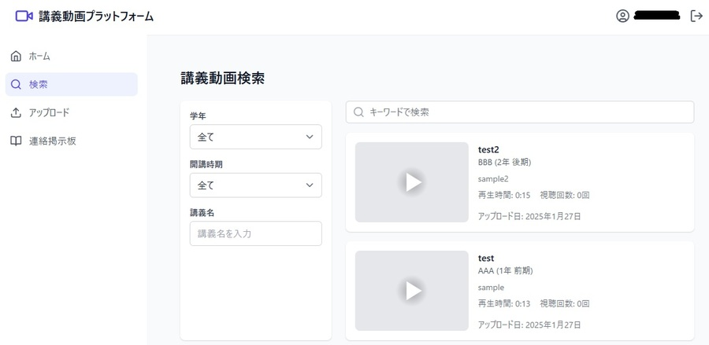
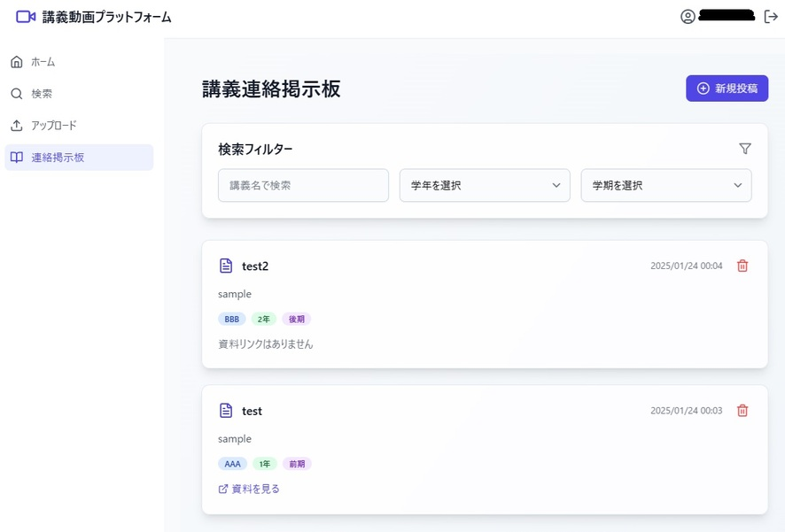

# 大学講義動画プラットフォーム：学習支援のためのデジタルツール

## 目的

このシステムは、教員が講義動画を簡単にアップロードし、学生が復習のために視聴できる環境を提供します。講義動画のほか、教員からの連絡事項や資料も効率的に管理し、検索機能を通じて必要な情報を素早く見つけることができます。




## 主な機能

### 1. ユーザー認証

- Googleアカウントを使用したログイン
- 大学メールドメインによる利用制限
- 教員・学生の自動識別
- 学生: 数字とPを含むパターン
- 教員: 小文字とハイフンのパターン
- Firestoreへのユーザー情報保存（メール、ロール、表示名）
- ログイン時にユーザー情報をデータベースに記録

### 2. 講義動画検索

検索可能な条件：
- 学年（1-6年）
- 開講時期（前期/後期）
- 講義名
- キーワード
- Firestoreを使用したリアルタイム検索
- 検索結果の作成日時降順表示

### 3. 動画再生機能

- 全画面表示
- 視聴進捗の記録
- 視聴履歴の管理
- 現在の再生時間と総再生時間の表示

### 4. 講義連絡掲示板

- 講義関連情報の共有
- 学年・学期による情報整理
- 資料リンクの添付
- 通知の作成、表示、削除
- 高度な検索・フィルタリング（講義名、学年、学期）
- 教員モードでは新規投稿と削除が可能
- UIに講義名、学年、学期のタグ、オプションの資料リンク表示

### 5. 教員向け機能

- 講義動画アップロードインターフェース
  - メタデータ入力（タイトル、説明、講義名、学年、開講時期）
  - Firebaseを使用して動画情報を保存
  - バックエンド（localhost:3001）にビデオファイルをアップロード
  - アップロード進捗状況の表示
  - アップロード中のローディング状態とボタンの無効化
- 講義連絡事項の投稿機能
  - タイトル、内容、講義名、学年、学期の入力
  - オプションの資料リンク

## 技術基盤

- フロントエンド：React、TypeScript
- バックエンド：Firebase、Express.js
- デプロイメント：Docker、Nginx

## 
# プロジェクトのセットアップ手順

## ディレクトリ構成

```
.
│  .env
│  docker-compose.yml
│  Dockerfile
│  Dockerfile.backend
│  eslint.config.js
│  index.html
│  package-lock.json
│  package.json
│  postcss.config.js
│  tailwind.config.js
│  tsconfig.app.json
│  tsconfig.json
│  tsconfig.node.json
│  vite.config.ts
│  
├─docker
│      nginx.conf
│      
├─public
│  └─videos
│
└─src
    │  App.tsx
    │  index.css
    │  main.tsx
    │  vite-env.d.ts
    │  
    ├─api
    │      server.ts
    │      
    ├─components
    │      Layout.tsx
    │      Navbar.tsx
    │      PrivateRoute.tsx
    │      Sidebar.tsx
    │
    ├─contexts
    │      AuthContext.tsx
    │
    ├─lib
    │      firebase.ts
    │
    ├─pages
    │      Home.tsx
    │      Login.tsx
    │      Materials.tsx
    │      NotificationForm.tsx
    │      Search.tsx
    │      Upload.tsx
    │      VideoPlayer.tsx
    │
    └─types
            index.ts
```

## セットアップ手順

1. リポジトリをクローンします。

   ```sh
   git clone https://github.com/your-username/your-repo.git
   ```

2. クローンしたディレクトリに移動します。

   ```sh
   cd your-repo
   ```

3. `public/videos` ディレクトリを作成します（動画ファイルの保存に必須）。

   ```sh
   mkdir -p public/videos
   ```

4. 環境変数を設定します。`.env` ファイルを作成し、下記の通り必要な設定を記述してください。事前に[Firebase](https://console.firebase.google.com/)のプロジェクト作成を行ってください。


以上でプロジェクトのセットアップは完了です。


### システム構成
このシステムはDocker Composeを使用して構築され、以下の3つのサービスで構成されています。

**使用方法：**

1. プロジェクトのルートディレクトリで以下のコマンドを実行:
 
```bash
docker-compose up --build
```

2. バックグラウンドで起動:
```bash
docker-compose up -d
```

3. ブラウザで `http://localhost:8080` にアクセスしてアプリケーションを確認

4. サービスの停止:
```bash
docker-compose down
```

**構成内容：**

- `backend` サービス（ポート3001）：Node.jsのバックエンドアプリケーション
- `frontend` サービス（ポート8080）：Reactベースのフロントエンド
- `nginx` サービス（ポート80）：リバースプロキシ、動画配信


# Firestore インデックス設定のドキュメント

## コレクションID: notifications
### インデックス設定一覧

| #  | フィールド                          | ソート順         |
|----|-----------------------------------|----------------|
| 1  | course, createdAt, name            | Asc, Desc, Asc  |
| 2  | createdAt, semester, name           | Desc, Asc, Asc  |
| 3  | createdAt, course, semester, name   | Desc, Asc, Asc, Asc |
| 4  | createdAt, course, grade, name       | Desc, Asc, Asc, Asc |
| 5  | createdAt, grade, semester, name     | Desc, Asc, Asc, Asc |
| 6  | createdAt, course, grade, semester, name | Desc, Asc, Asc, Asc, Asc |
| 7  | createdAt, course, name              | Desc, Asc, Asc  |
| 8  | createdAt, grade, name                | Desc, Asc, Desc |
| 9  | grade, createdAt, name                | Asc, Desc, Desc |
| 10 | grade, semester, createdAt, name      | Asc, Asc, Desc, Desc |

---

## コレクションID: videos
### インデックス設定一覧

| #  | フィールド                                | ソート順         |
|----|-----------------------------------------|----------------|
| 1  | status, lecture_name, created_at, name   | Asc, Asc, Desc, Desc |
| 2  | status, grade, created_at, name          | Asc, Asc, Desc, Desc |
| 3  | status, created_at, name                  | Asc, Desc, Desc |
| 4  | status, semester, created_at, name        | Asc, Asc, Desc, Desc |

---

## 注意事項
- 複合フィールドを選択し、パスは少なくとも2つの項目への入力が必要
- クエリスコープはすべて「コレクション」
- すべてのインデックスは「有効」状態

## .envファイルの設定

Firebaseのコンソールに移動してプロジェクトを作成します。
「プロジェクトの設定」で、マイアプリのフレーム内にFirebaseConfigが示されていますので、`.env`ファイルの各環境変数にコピーペーストしてください。なお、本システムでは、Firebase storageは利用していません。

```env
VITE_API_KEY=XXX・・・XXX
VITE_AUTH_DOMAIN=XXX・・・XXX
VITE_PROJECT_ID=XXX・・・XXX
VITE_STORAGE_BUCKET=XXX・・・XXX
VITE_MESSAGING_SENDER_ID=XXX・・・XXX
VITE_APP_ID=XXX・・・XXX

VITE_ALLOWED_DOMAIN=XXX.ac.jp（XXX.comなど）
```

また、`VITE_ALLOWED_DOMAIN` には大学（または組織）のメールドメインを設定してください。

以上の設定を適用することで、システム構築の準備が完了します。


